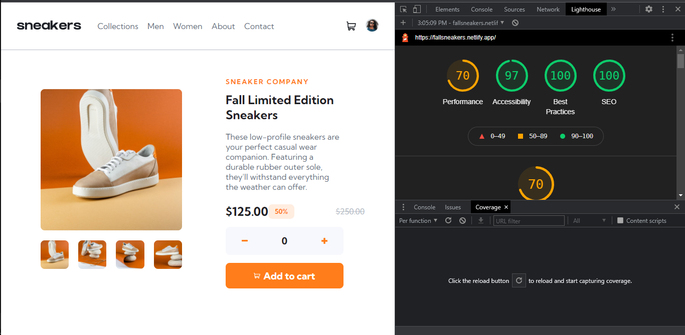

# Table of contents

- [Overview](#overview)
  - [The challenge](#the-challenge)
  - [Screenshot](#screenshot)
  - [Links](#links)
- [My process](#my-process)
  - [Built with](#built-with)
  - [What I learned](#what-i-learned)
  - [Continued development](#continued-development)
  - [Useful resources](#useful-resources)
- [Acknowledgments](#acknowledgments)

## Overview
So this was a challenge I built to refresh me building sites with only the basics: HTML, CSS and Javascript. It is an e-commerce landing page for a sneakers company advertising their latest product: The Fall Special. The website allowed users to view the product, interact with the different images and even add products to cart to checkout.

### The challenge

Users should be able to:

- View the optimal layout for the site depending on their device's screen size
- See hover states for all interactive elements on the page
- Switch the large product image by clicking on the small thumbnail images
- Add items to the cart
- View the cart and remove items from it
- Interact with a website that is optimal, fast and data-saving

### Screenshot

### Links

- Solution URL: [https://github.com/sodiqsanusi/frontendme-ecommer3/]()
- Live Site URL: [https://fallsneakers.netlify.app/]()

## My process

### Built with

- Semantic HTML5 markup
- CSS custom properties
- Flexbox
- Mobile-first workflow
> Used only basic tools and languages so the website could be optimal
### What I learned

Optimizing code to be fast, high performing and user-friendly was something I'm proud to have learned during this project.
Identifying and deferring under-the-fold CSS and JS, while making the critical CSS and JS needed always ready was a new thing the project helped me understand.
If you want more help with writing markdown, we'd recommend checking out [The Markdown Guide](https://www.markdownguide.org/) to learn more.

### Continued development

So I discovered I'm not really comfortable with the same optimization I learnt a great deal of while building this project so I'll probably learn more about it before diving in my next project two days from now.

### Useful resources

- [Resource on deferring render blocking resources](https://web.dev/render-blocking-resources/) - This helped me for inlining critical resources and the understanding of how to know which parts of code should be critical or not. I really liked its pattern of explaining and will surely use it while trying to learn more about code optimization.

## Acknowledgments

Special thanks to the web.dev development team for the numerous articles on web development and to my mentor Raks, you keep me going most times man 🐥 .
